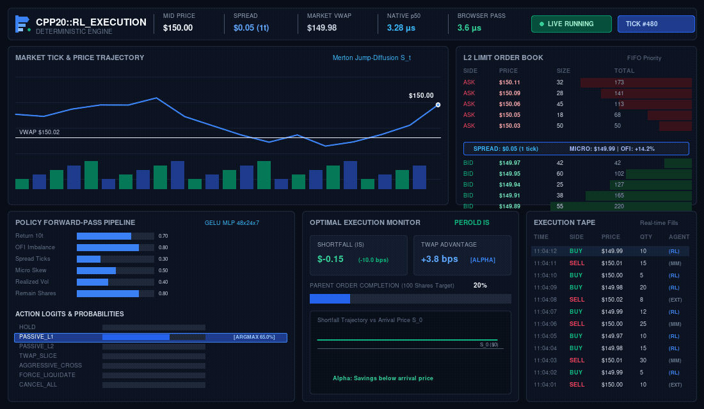

# CPP20-RL-EXECUTION: Low-Latency Algorithmic Execution Terminal

<p align="center">
  
</p>

<p align="center">
  <strong>Native C++20 Optimal Execution Engine · L2 Matching · RL Inference · WebAssembly Terminal</strong>
</p>

<p align="center">


</p>

> A native C++20 optimal-execution engine prototype with a fixed-capacity L2 matching engine, deterministic market simulation, RL policy inference, implementation-shortfall analytics, reproducible native benchmarking, and an interactive WebAssembly quantitative terminal.

---

## System in Motion

<p align="center">
  
</p>

<p align="center">
  <sub>
    Market state → L2 order book → observation vector → RL policy → execution → shortfall
  </sub>
</p>

---

## System Architecture

```text
┌───────────────────────────────────────────────────────────────────────────────┐
│                  DETERMINISTIC SIMULATION & INFERENCE PIPELINE                │
└───────────────────────────────────────────────────────────────────────────────┘

 [1. EVENT TICK]        [2. FEATURE STATE]       [3. RL POLICY]       [4. EXECUTION]
 ─────────────────      ──────────────────       ──────────────       ─────────────
 Market simulation      10D observation         GELU MLP              FIFO Queue
 L2 updates             OFI / spread            Softmax               Market Fill
 Poisson arrivals       Micro-price             7 actions             Shortfall
         │                       │                    │                    │
         ▼                       ▼                    ▼                    ▼
 ┌──────────────┐       ┌──────────────┐      ┌──────────────┐      ┌──────────────┐
 │    L2 BOOK   │ ────► │ OBSERVATION  │ ───► │ NEURAL POLICY│ ───► │  EXECUTION   │
 │   SNAPSHOT    │      │    VECTOR    │      │   FORWARD    │      │    ENGINE    │
 └──────────────┘       └──────────────┘      └──────────────┘      └──────────────┘
```

---

## Terminal Preview

<p align="center">
  
</p>

### Live Terminal

```text
┌──────────────────────────────────────────────────────────────────────────────┐
│ CPP20::RL_EXECUTION   [C++20] [WASM] [OPTIMAL EXECUTION]   Browser Pass ... │
├───────────────────────────────────────────────────────────┬──────────────────┤
│                                                           │                  │
│ MARKET TICK & EXECUTION FEED                              │ L2 ORDER BOOK    │
│ • Live price curve                                        │ • BBO            │
│ • VWAP                                                     │ • Queue depth    │
│ • Arrival target                                           │ • OFI / Spread   │
│ • Volume                                                   │ • Micro-price    │
│                                                           │                  │
├───────────────────────────────────────────────────────────┼──────────────────┤
│                                                           │                  │
│ POLICY FORWARD-PASS PIPELINE                              │ CUMULATIVE       │
│ • Observation Vector                                      │ MARKET DEPTH     │
│ • GELU activations                                         │ • Bid curve      │
│ • Action distribution                                      │ • Ask curve      │
│ • Selected ARGMAX                                          │ • Midpoint       │
│                                                           │                  │
├───────────────────────────────────────────────────────────┼──────────────────┤
│                                                           │                  │
│ OPTIMAL EXECUTION MONITOR                                 │ EXECUTION TAPE   │
│ • Implementation Shortfall                                 │ • BUY / SELL     │
│ • Average Fill                                             │ • Price / Qty    │
│ • Completion                                               │ • Participant    │
│ • TWAP comparison                                          │ • RL fills       │
│ • Shortfall trajectory                                     │ • Scroll buffer  │
│                                                           │                  │
└───────────────────────────────────────────────────────────┴──────────────────┘
```

---

## Native C++20 Core

- C++20 Concepts-constrained execution policy
- Fixed-capacity intrusive L2 matching engine
- FIFO price-time priority
- Cache-line-aware `PriceLevel` layout
- Numerically stable GELU and Softmax
- Deterministic Merton Jump-Diffusion simulation
- Poisson order replenishment
- Perold Implementation Shortfall
- Standalone native correctness suite
- Instrumented `new` / `delete` tracking
- Reproducible native benchmark

---

## Native Benchmark

```text
Portable Release (-O3)

p50:        3,280 ns
p90:        3,289 ns
p99:        6,634 ns
p99.9:     11,208 ns

Mean:
3,392.3 ns

Throughput:
290,396 inferences/sec
```

> These values were measured on the specified host and are not universal performance guarantees.

### Optional Host Optimization

```text
-march=native

p50:
3,136 ns

Throughput:
307,423 inferences/sec
```

---

## Correctness

```text
Native C++20 Test Suite
88 / 88 assertions passed

ASan + UBSan
0 errors
0 leaks

TypeScript
0 errors

Production Build
PASSED
```

---

## Native vs Browser

| | Native C++20 | Browser / WebAssembly |
|---|---|---|
| Runtime | Standalone binary | Browser V8 / WASM |
| Timing | `steady_clock` | `performance.now()` |
| Representative latency | **3,280 ns p50** | **3.6 µs browser pass** |
| Purpose | Systems core | Interactive terminal |

---

## Architecture

```text
Market Simulation
       │
       ▼
   L2 Order Book
       │
       ├── Best Bid / Ask
       ├── Spread
       ├── Micro-Price
       └── OFI
       │
       ▼
 Observation Vector
       │
       ▼
 Native RL Policy
       │
       ▼
 Action Distribution
       │
       ▼
 Execution Engine
       │
       ▼
 Implementation Shortfall
       │
       ▼
 WebAssembly Terminal
```

---

## Brand

<p align="center">
  
</p>

<p align="center">
  <strong>CPP20::RL_EXECUTION</strong>
</p>

---

## Repository

```text
cpp20-rl-execution/
│
├── cpp/
│   ├── include/
│   │   ├── types.hpp
│   │   ├── order_book.hpp
│   │   ├── neural_policy.hpp
│   │   └── market_simulator.hpp
│   │
│   ├── src/
│   │   └── main.cpp
│   │
│   ├── tests/
│   │   └── test_engine.cpp
│   │
│   ├── benchmarks/
│   │   └── latest.txt
│   │
│   ├── CMakeLists.txt
│   └── Makefile
│
├── src/
│   ├── components/
│   ├── engine/
│   ├── hooks/
│   └── App.tsx
│
├── assets/
│   ├── cpp20-rl-execution-demo.gif
│   ├── terminal-live-demo.gif
│   └── brand-mark.svg
│
├── DESIGN.md
├── LICENSE
└── package.json
```

---

## Quickstart

```bash
git clone https://github.com/<your-username>/cpp20-rl-inference-engine.git
cd cpp20-rl-inference-engine

npm install
npm run dev
```

### Native C++20

```bash
cmake -S cpp \
  -B cpp/build \
  -DCMAKE_BUILD_TYPE=Release

cmake --build cpp/build --parallel

./cpp/build/hft_test
./cpp/build/hft_benchmark
```

### Host Optimized

```bash
cmake -S cpp \
  -B cpp/build_native \
  -DCMAKE_BUILD_TYPE=Release \
  -DENABLE_NATIVE_OPT=ON

cmake --build cpp/build_native --parallel
```

---

## License

MIT
